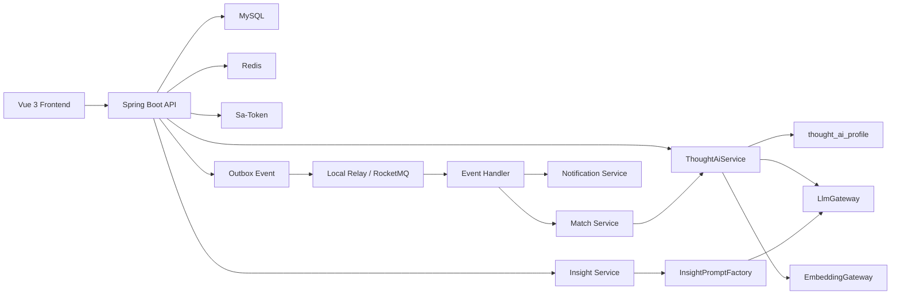

# 新生论坛系统亮点与 AI 实现说明

## 1. 文档目的

这份文档用于系统化说明本项目的：

- 技术亮点
- 中间件职责
- 模块功能与实现方式
- AI 在项目中的落地场景、工程设计与底层原理

它不是单纯的“技术栈清单”，而是面向项目汇报、秋招面试、答辩讲解的说明材料。

## 2. 项目一句话概括

新生论坛是一个围绕“念头发布、相似匹配、关系建立、每日启发”构建的前后端分离社区项目。  
后端以 `Spring Boot + MySQL + Redis + RocketMQ + Flyway + Sa-Token` 为核心，前端使用 `Vue 3 + TypeScript + Vite + Pinia + Vue Router`。

## 3. 系统技术亮点

### 3.1 亮点概览

1. 主链路事务化，扩散链路异步化  
   念头发布先完成数据库写入，再通过 Outbox 异步扩散到匹配、通知等下游，兼顾一致性和性能。

2. MySQL 持久化 + Flyway 版本化建表  
   表结构、索引、种子数据全部通过迁移脚本管理，避免“手工建表”和“环境不一致”。

3. 匹配逻辑 AI 增强且仍可解释  
   当前相似度方案已经升级为“Embedding 语义相似度 + 词法重合度 + 念度权重 + 用户总相似值挡位”，兼顾效果与可解释性。

4. AI 能力可替换、可测试、可降级  
   通过 `LlmGateway` 和 `EmbeddingGateway` 把具体模型调用与业务隔离，运行时默认直连兼容协议网关，当前配置示例切到智谱 AI，测试环境用本地替身保证回归稳定；当上游额度不足或接口异常时，业务会降级到结构化兜底结果而不是直接报 500。

5. 缓存策略精细化  
   用户资料、用户列表、每日启发、未读通知数分别走不同 TTL，避免“一把梭缓存”。

6. MQ 链路具备工程化治理能力  
   已实现 Outbox 状态流转、失败重试、退避、死信、分区键和本地/ RocketMQ 双模式切换。

7. 前后端分离可本地联调  
   前端独立开发，后端通过 CORS 与 Vite Proxy 支撑本地开发、后续部署和演示。

### 3.2 架构示意



## 4. 中间件与基础组件作用

| 组件 | 作用 | 在项目中的具体使用 |
| --- | --- | --- |
| MySQL | 业务主存储 | 存储用户、念头、账号、关注、通知、Outbox 事件 |
| Redis | 高并发缓存层 | 缓存用户资料、用户列表、每日启发、未读通知数 |
| RocketMQ | 异步解耦与削峰 | 支撑 Outbox 事件投递、通知消息投递 |
| Flyway | 数据库版本管理 | 自动创建表、索引和种子数据，保证环境一致 |
| Sa-Token | 登录态与权限 | 登录、登出、鉴权、角色权限读取 |
| Spring Cache | 缓存抽象层 | 统一缓存注解，底层可切 simple cache 或 Redis |
| Docker Compose | 本地基础设施编排 | 一键启动 MySQL、Redis、RocketMQ |
| Vite | 前端开发/构建工具 | 本地热更新、构建产物输出、代理后端 API |
| Pinia | 前端状态管理 | 会话状态、BBS 数据状态统一管理 |
| Vue Router | 前端路由 | 登录页与论坛页切换、鉴权前置守卫 |

## 5. 业务模块与功能实现

## 5.1 用户与登录模块

### 用户功能

- 注册
- 登录
- 获取当前用户信息
- 获取角色与权限

### 实现方式

- `AuthController` 暴露 `/register`、`/login`、`/me`、`/logout`
- `AuthService` 负责注册、登录和当前用户解析
- 密码通过 `BCryptPasswordEncoder` 加密存储
- `Sa-Token` 负责登录态签发与校验
- `StpInterfaceImpl` 负责返回角色与权限列表

### 设计重点

- 账号信息与用户资料拆表
  - `user_account` 存登录凭证
  - `user_profile` 存昵称和简介
- 这样可以把“身份认证”和“展示资料”解耦，后续更适合扩展手机号、OAuth、多角色体系

## 5.2 念头发布模块

### 用户功能

- 发布念头
- 查看公共念头流
- 查看我的念头

### 实现方式

- `ThoughtController` 对外提供念头查询和发布接口
- `ThoughtApplicationService.publish()` 在一个事务中完成三件事：
  1. 写入 `thought_post`
  2. 清理该用户的每日启发缓存
  3. 写入 `outbox_event`
- 发布成功后会同步触发 `ThoughtAiService` 生成该条念头的 AI 画像：
  - 摘要
  - 标签
  - 审核结果
  - embedding 向量
- `GET /api/v1/thoughts/{thoughtId}/analysis` 可查询当前用户自己念头的 AI 分析结果

### 设计重点

- 主流程不直接同步做通知和匹配，避免发布接口被下游耗时拖慢
- 通过 Outbox 把“发布成功”和“异步处理”串起来，保证最终一致
- 公共流和公开用户页会过滤未通过 AI 审核的念头，内容治理和主业务共用同一份审核结果

## 5.3 匹配模块

### 用户功能

- 发布念头后看到同频候选
- 查看我的匹配结果
- 匿名共鸣升级为实名解锁

### 实现方式

- `MatchService` 读取当前用户念头与其他用户念头进行两层打分
- `ThoughtSimilarityCalculator` 计算单条念头相似分
- `UserSimilarityCalculator` 计算用户总相似值并判断匿名/实名挡位
- `ThoughtAiService` 为匹配提供摘要、标签、审核结果和 embedding，未通过审核的念头不会进入公开匹配

### 当前相似度原理

#### 单条念头相似分

```text
contentScore = 0.7 * semanticScore + 0.3 * lexicalScore
finalScore = 0.7 * contentScore + 0.3 * degreeScore
```

- `semanticScore`
  - 来自 embedding 余弦相似度
  - 当前统一通过 `EmbeddingGateway` 获取向量
  - 为了适配打分体系，余弦值会被映射到 `0~1`
- `lexicalScore`
  - 由 `ThoughtTextAnalyzer` 先做轻量中文/英文分词
  - 对中文会额外抽取 2-gram
  - 然后按交并比计算文本重合度，属于可解释的 Jaccard 风格方案
- `degreeScore`
  - 按念度权重比值计算
  - `CASUAL / FOCUSED / OBSESSION` 对应不同权重

#### 用户总相似值

```text
score = min(100, 相似念头数 * 12 + 平均单条相似分 * 40 + 平均念度得分 * 8)
```

### 为什么这样做

- 优点是可解释、可演示、便于调参
- 词法层能兜底，embedding 层能补足语义表达
- 以后接入向量库时，只需要升级召回层，不需要推翻现有精排和用户相似值公式

## 5.4 社交关系模块

### 用户功能

- 实名同频后关注对方
- 查看是否已关注、是否互关

### 实现方式

- `SocialController` 提供关注与关注状态接口
- `SocialGraphService` 负责 follow 逻辑
- `user_follow` 表通过联合唯一键限制重复关注

### 设计重点

- 关系升级来自“念头相似值”，不是直接陌生人社交
- 这样更贴合产品设定，也让业务链路更完整

## 5.5 通知模块

### 用户功能

- 收到“有人和你产生了同频”的通知
- 查看通知列表
- 查看未读数
- 标记已读

### 实现方式

- `NotificationService.create()` 先把通知落库，再调用 `MessagePublisher` 推送投递消息
- 本地模式下由 `LocalMessagePublisher` 直接调用 `NotificationDeliveryHandler`
- `rocketmq` 模式下由 `RocketMqMessagePublisher` 发到 MQ，再由 `RocketMqNotificationListener` 消费
- 未读数通过 `@Cacheable` 缓存，写入和已读时通过 `@CacheEvict` 失效

### 设计重点

- 通知“数据落库”和“消息投递”分开
- 即使投递失败，通知数据还在数据库里，不会丢主记录

## 5.6 每日启发模块

### 用户功能

- 查看 AI 生成的每日启发
- 获取一句提醒、一段解读和一组行动建议

### 实现方式

- `InsightService.buildDailyInsight(userId)` 是入口
- 它会：
  1. 读取用户最新念头
  2. 读取该念头的 AI 摘要与标签
  3. 读取该用户当前的同频候选
  4. 调用 `InsightPromptFactory` 组装提示词对象
  5. 调用 `LlmGateway.generateDailyInsight()`
  6. 返回 `headline + interpretation + actions`

### 设计重点

- `dailyInsight` 结果被缓存，避免重复生成
- 新发布念头时通过 `evictDailyInsight()` 失效缓存，保证启发内容随表达更新
- 大模型输出要求是结构化 JSON，而不是自由文本，便于服务端稳定解析与前端直接消费

## 5.7 Outbox 与异步事件模块

### 用户功能对应

用户感知到的是“我发完念头后系统会异步完成匹配、通知、后续扩散”，但这个模块本质是工程能力模块。

### 实现方式

- `OutboxEventPublisher` 在主事务中向 `outbox_event` 写入一条待处理事件
- `OutboxEventProcessor` 定时扫描待处理事件
- `OutboxRelay`
  - 非 `rocketmq` 环境下走 `LocalOutboxRelay`
  - `rocketmq` 环境下走 `RocketMqOutboxRelay`
- `RocketMqOutboxEventListener` 消费 MQ 消息
- `OutboxEventDispatcher` 根据事件类型分发给真正的 handler
- `ThoughtPublishedEventHandler` 执行匹配并创建通知

### 状态流转

```text
PENDING -> PROCESSING -> PUBLISHED -> PROCESSED
                     \-> FAILED -> DEAD
```

### 设计重点

- 失败重试
- 指数退避
- 死信出口
- 分区键有序投递
- 本地模式与 MQ 模式统一抽象

这是项目里非常适合面试展开的一条链路，因为它体现了：

- 最终一致性
- 异步解耦
- 幂等消费
- 失败治理

## 5.8 缓存模块

### 缓存对象

- `userProfile`
- `userList`
- `dailyInsight`
- `notificationUnreadCount`

### 实现方式

- 默认用 `Spring Cache + simple cache`
- 打开 `redis` profile 后切换到底层 Redis
- `RedisCacheProfileConfig` 为不同缓存名设置不同 TTL

### 设计重点

- 用户资料和用户列表适合较长 TTL
- 每日启发适合中等 TTL
- 未读通知数适合短 TTL + 显式失效

## 5.9 审核台模块

### 用户功能

- 管理员查看待复核念头
- 查看 AI 摘要、标签、审核原因和原始内容
- 人工将内容改判为 `APPROVED / REJECTED`
- 查看 AI 初判到人工复核的完整时间线
- 查看审核总量、AI 初判量、人工复核量、改判次数、今日决策量
- 按来源、操作人、审核结果、日期范围检索审核日志
- 分页浏览审核日志，并导出 CSV 给运营或风控复盘

### 实现方式

- `AuditController` 提供审核台查询与决策接口
- `AuditService` 聚合念头内容、用户信息和 `thought_ai_profile`
- `ThoughtAiService.overrideModeration()` 负责把人工决策写回 AI 画像表
- `audit_record` 记录 AI 初判和人工改判，形成完整审核时间线
- `AuditSummaryView` 聚合当前审核池状态与审核记录统计，作为运营概览卡片数据源
- `GET /api/v1/audit/records` 支持多条件过滤，用于运营排查和审核回溯
- `GET /api/v1/audit/records/page` 返回分页结果，`GET /api/v1/audit/records/export` 输出 UTF-8 BOM CSV
- 当前演示环境中，`linxi` 同时具备普通用户和管理员角色

### 设计重点

- AI 审核不是终点，人审才是最终兜底
- 审核结果直接复用已有的 AI 画像表，不额外引入一套重复状态
- 改判后公共流和匹配链路会立即读取新状态，形成治理闭环

## 5.10 前端模块

### 用户功能

- 登录注册
- 查看论坛广场
- 发布念头
- 查看我的念头
- 查看同频匹配
- 查看通知中心
- 查看每日启发

### 实现方式

- `Vue 3 + TypeScript + Vite + Pinia + Vue Router`
- `session store` 负责登录态
- `bbs store` 负责论坛数据聚合
- `router.beforeEach` 负责登录页与论坛页的路由守卫

### 设计重点

- 前后端分离后更贴近真实部署方式
- 前端层把“会话状态”和“业务数据状态”拆开，结构更清晰

## 6. AI 在项目中的应用

这一部分是本项目最容易被问深的一块，需要严格区分：

- 当前已经落地的 AI 能力
- 未来为面试扩展预留的 AI 能力

## 6.1 当前已经落地的 AI 能力

### 场景一：每日启发生成

输入：

- 用户最新一条念头
- 该念头的 AI 摘要
- 该念头的 AI 标签
- 当前同频关系摘要

输出：

- 一句话提醒
- 一段解读
- 一组行动建议

技术结构：

```text
ThoughtRepository + ThoughtAiService + MatchService
    -> InsightPromptFactory
    -> LlmGateway
    -> DailyInsightGeneration
```

### 场景二：AI 标签提取与摘要生成

- `ThoughtAiService` 在念头级别生成一份 `thought_ai_profile`
- `LlmGateway.analyzeThought()` 返回结构化 JSON
- 系统会把 `summary / tags / provider / model / promptVersion` 一并持久化

这让 AI 结果从“即时返回的字符串”变成了“可复用的业务资产”。

### 场景三：AI 审核与内容治理

- 大模型会给出 `APPROVED / REVIEW / REJECTED`
- `REJECTED` 念头不会进入公共流，也不会参与同频匹配
- 审核原因会存储下来，方便后续人工复核或运营排查
- 管理员可以在审核台对 `REVIEW / REJECTED / APPROVED` 内容进行人工改判
- AI 初判和人工改判都会写入 `audit_record`，便于追踪审核链路

### 场景四：Embedding 语义相似匹配

- `EmbeddingGateway` 负责把念头内容转成向量
- `ThoughtSimilarityCalculator` 会同时计算 embedding 余弦相似度和词法相似度
- 最终把语义层与规则层融合成统一内容分

## 6.2 AI 这条链路是怎么工作的

### 第一步：生成念头级 AI 画像

当系统首次需要分析某条念头时，`ThoughtAiService` 会：

- 调用 `LlmGateway.analyzeThought()`
- 调用 `EmbeddingGateway.embed()`
- 把摘要、标签、审核状态、审核原因、embedding 一次性落库到 `thought_ai_profile`

这样后续匹配、启发、审核展示都能复用这份结果，而不是重复打模型。

### 第二步：做结构化 Prompt 组装

`InsightPromptFactory` 不会把一大段原始业务对象直接交给模型，而是组装出清晰字段：

- `latestThought`
- `latestSummary`
- `latestTags`
- `themes`
- `resonanceSummary`

这一步能显著降低 Prompt 噪声，也让模型输出更稳定。

### 第三步：要求模型输出结构化 JSON

无论是每日启发还是念头分析，模型都被要求只返回 JSON：

- 每日启发：`headline / interpretation / actions`
- 念头分析：`summary / tags / moderationStatus / moderationReason`

这样服务端可以直接解析成对象，而不是从自由文本里二次抽取。

### 第四步：把 AI 结果接回主业务

- 启发场景中，`InsightService` 直接消费结构化结果
- 匹配场景中，`ThoughtSimilarityCalculator` 消费 embedding
- 治理场景中，`ThoughtController` 和 `MatchService` 消费审核结果

也就是说，AI 在这个项目里不是“外挂文案器”，而是主业务链路的一部分。

### 第五步：缓存、持久化与降级

- `dailyInsight` 会缓存，避免高频重复生成
- 念头级 AI 画像会持久化，避免重复分析
- 运行时默认直连兼容协议网关，当前示例为智谱 AI
- 上游 AI 不可用时，念头分析会降级成 `REVIEW` 状态，启发接口会返回结构化兜底文案
- 自动化测试使用本地替身，避免回归依赖外部模型服务

## 6.3 AI 相关原理，面试时可以怎么讲

### 原理一：Prompt Engineering

项目里的 Prompt 不是把整段上下文原样拼进去，而是先做字段化、主题归纳和匹配摘要压缩，再交给模型。  
这会让模型输出更加稳定，也更容易做版本化管理。

### 原理二：Structured Output

大模型最容易出问题的地方是“回复风格不稳定”。  
所以这里统一要求 JSON 输出，再由服务端反序列化成 `DailyInsightGeneration` 和 `ThoughtAnalysisGeneration`。  
这本质上是在用结构化协议约束生成式模型，降低集成风险。

### 原理三：Embedding + Cosine Similarity

念头文本先经过 embedding 模型转成向量，再通过余弦相似度衡量语义接近程度。  
为了适配现有打分体系，余弦值会被归一化到 `0~1`，然后和词法分数做融合。  
这样即使两句话字面不同，只要语义接近，也有机会命中同频匹配。

### 原理四：模型网关抽象

`LlmGateway` 和 `EmbeddingGateway` 的意义是把：

- 厂商差异
- 协议差异
- 鉴权方式差异
- 失败处理差异

全都挡在业务边界之外。  
业务层只关心“拿到摘要、标签、审核结果和向量”，不会直接依赖某个具体 SDK。

### 原理五：AI 可降级、可缓存、可追踪

AI 能力要想进生产，必须同时解决：

- 成本
- 时延
- 稳定性
- 可追踪性

所以这里做了三层保障：

- 测试环境使用本地替身，保证回归可跑
- `thought_ai_profile` 持久化，避免重复打模型
- `dailyInsight` 缓存，降低高频生成成本
- 上游模型失败时返回结构化兜底结果，保证发帖和启发主链路可用

## 6.4 当前 AI 能力的边界

这点在面试里一定要说清楚。

### 已实现

- `LlmGateway` 与 `EmbeddingGateway` 双网关抽象
- 运行时 `compatible` + 测试环境本地替身
- 每日启发结构化生成链路
- 念头摘要、标签、审核、embedding 持久化
- embedding 语义相似匹配
- 公共流和匹配链路的 AI 审核过滤
- AI 结果缓存与失效
- AI 上游限流/额度异常时的结构化降级

### 仍可继续演进

- 向量库粗排召回
- Prompt 模板版本管理后台
- 审核复核台与运营看板
- 多模型路由、熔断与限流治理
- 用户长期画像与情绪趋势分析

### 为什么这样设计

因为秋招项目最重要的不是“堆最多中间件”，而是：

- 核心链路真的跑通
- 抽象边界是对的
- 后续演进路径清晰

## 7. 面试时最值得重点讲的内容

### 可以优先讲的 5 个点

1. 为什么发布链路采用“事务写库 + Outbox 异步扩散”
2. 为什么匹配逻辑先用可解释公式，而不是一开始就上向量库
3. 为什么 AI 能力必须通过 `LlmGateway` 抽象
4. 为什么每日启发要做缓存和主动失效
5. 为什么缓存、MQ、数据库三层在这个项目里各自有明确边界

### 一句话总结版本

这个项目的核心不是“我用了多少技术”，而是：

- 我把一个带社区、推荐、异步一致性和 AI 能力的业务闭环真正跑通了
- 我知道每一层为什么这样设计
- 我也知道它接下来如何演进到更接近真实生产系统

## 8. 总结

新生论坛的技术价值体现在三点：

1. 它不是简单 CRUD，而是有完整业务闭环的社区系统
2. 它不是只写接口，而是把缓存、消息队列、事务一致性、前后端分离一起做了
3. 它不是把 AI 当聊天噱头，而是把 AI 放进了“内容理解 -> Prompt 组织 -> 结果生成 -> 缓存治理”的完整链路中

如果把它作为秋招项目，它能覆盖的面试能力包括：

- Java 后端开发
- 数据库与索引设计
- 缓存与消息队列
- 一致性与异步架构
- 前后端联调
- AI 工程化集成
